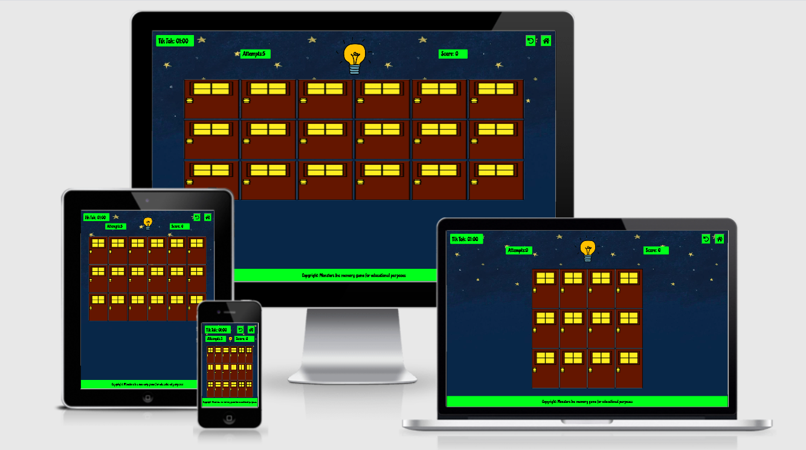
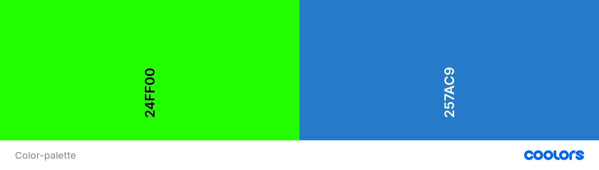
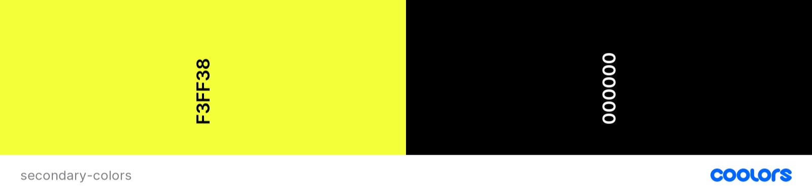

<h1 align="center">Monsters.Inc Memory Game </h1>

[>>To view live site click here<<](https://yetnetbehailu.github.io/MonstersInc-game/)

---
 ## User Experience (UX)
 
-   ### Project Goals ###
     - The aim of this project is to combine my current knowledge in HTML and CSS with what I've learned from the JavaScript and Interactive Front End modules, provided at Code Institute's Full Stack Developer course. As to be able to build an entertaining, interactive and visually appealing card memory game web application. More specifically a MonstersInc inspired memory flip card game, suitable for all ages.

- ### Site Owner Goals ###

    - _"As **site owner**, I want to create an interactive game that challenges the user & helps improve memory skills. "_
    - _"As **site owner**, I want to create a game that's fun and suitable for all ages."_
 
    - _"As **site owner**, I want to create a visually appealing site with clear game instructions."_
 
    - _"As **site owner**, I want to further develop my knowledge and skills in writing JavaScript & jQuery code."_
 
-  ### User stories ###
 
   - _"As a **user**, I want a game that is fun to play."_
 
   - _"As a **user**, I want the game to challenge my memory."_
 
   - _"As a **user**, I want to easily access instructions on how to play."_
 
   - _"As a **user**, I'd like a time limit to add more of a challenge."_
 
   - _"As a **user**, I'd like a card drawing limit to add more of a challenge."_
 
   - _"As a **user**, I want the option to change the level of difficulty to add complexity when desired."_
 
   - _"As a **user**, I want to be able to read my score result_".

### Wireframe ###
I designed my web application layout using [Figma wireframes](https://www.figma.com). Main criteria was to create an eye-catching bright and vibrant environment, without losing the context visibility maintaining a readable and coherent site. Not to many elements of distractions but rather a simple and clean aesthetic. View my wireframes for each different device below;

**Desktop** wireframe [here](https://github.com/yetnetbehailu/MonstersInc-game/blob/master/assets/wireframes/desktop-wireframe.png)
 
**Tablet** wireframe [here](https://github.com/yetnetbehailu/MonstersInc-game/blob/master/assets/wireframes/tablet-wireframe.png)
 
**Mobile** wireframe [here](https://github.com/yetnetbehailu/MonstersInc-game/blob/master/assets/wireframes/mobile-wireframe.png)
 

  
<strong>Wireframe updates:</strong>

  

 - On the current start page there is a button on the top left corner that has been added for sound. In the initial phase I had not thought of adding sound to my web application, this rather occurred to me whilst building my page.

 - The buttons inside the "Start Game" button which re-directs to the different game levels, has got less of a round shape and more of a rectangle shape. 

  

---

 ## Design ##

 The overall look and feel of the game application is heavily inspired by the MonstersInc movie, as I wanted to create a simple yet attention grabbing and fun game application, for users of all ages to enjoy.

 - I've kept the amount of elements on each page to a minimum as I wanted to achieve an uncluttered and clean aesthetic.

 - The interaction design provides predictability, as users are provided with cues across the application that helps them predict the result of an action. Buttons include signalmen in form of icons or written text that hint what will occur when pressed.

 - The interface also provides subtle visual feedback associated with points of actions such as hover, focus and button press. To provide some indication to user that an action has been acknowledged.

 - I've used Bootstrap for the layout on the home page and both Bootstrap and Flexbox to conduct layout on game page. (Flexbox mainly to contain my cards according to desired alignment order).

 - The game is designed to be responsive and suitable for play on all devices. Game structure remains the same on all formats, with elements scaling down on smaller screen devices.

- ** Colors: **

- The color scheme will tie into the theme maintaining cohesion and readability.The main colours used are displayed below from [Coolors](https://coolors.co/)  

Both of the primary colors are used for the main elements of the application as I felt they complemented each other well and were fun, bright and vibrant just like the main movie characters keeping with the aesthetic I was aiming for. 

   - #24FF00 Harlequin green shade: Start page full body background color. Game page footer,timer,scoreboard & attempts-board background color.
   Resembling one of the main characters from the movie. Mike mikowski the very bright (literally and figuratively speaking) green round shape, one eyed monster coach and best friend of the monster world most prominent scarer.

   - #257ac9 Dodger Blue shade: Start page background color of sound button, head title, instructions button, instructions modal, start game button, start game modal and footer.This color was chosen not only because of the close resemblance to main monster character Sully, but also because of the color similarity to the MonstersInc logo. 
   
   Secondary colors used:

  - #F3FF38 Gorse yellow shade: 
  Implemented on the game over & win modal. Supposed to simulate light(energy) that is needed to power the monster city.

  - #000000 Black: Incorporated for icons & smaller written text throughout site to enhance visibility as the two primary colors could cause difficulty for people with visual impairment to tell apart when smaller. Ironically the black color was chosen as replacement as it suitable could represent the color of the pupil in the MonstersInc iconic logo. 

 - ** Typography:**
   - "Chicle" used as primary font throughout the whole website with Sans Serif as fallback font in case for any reason the font isn't imported into the site correctly. I choose "Chicle" because the style was the opposite of strict and plain, rather fun and quirky whilst still  maintaining good readability.

 - ** Images:**

 - Images used are meant to reflect the characters and most characteristic elements of the movie.

 - The iconic MonstersInc logo and group image of the most memorable characters are displayed on the start page.

 - For the game page I've added a simple background image without overbearing features that could overwhelm the user. The image depicts a starry night, which in the movie translates to the monsters usual work time hours whilst bedtime hours for the children in the human world.

-  The reason I choose to use a door image as background for the back of my cards, is to simulate the story line where the monsters enter through doors that activate portals to children's bedroom closets.

- To not overshadow the colorful characters the card images chosen display them in front of a white background. 

- The light bulb image used in the game page header area is supposed to simulate light/energy essential to power the monster city.

- ** Icons, Animations & Effects:**

- I added overlays with a fade-in animation on both start page and game page. For start page the overlays gets displayed when "how to play" button and "start game" button is pressed, to highlight the modal-messages.
Whilst on game page the overlays fade in when the game is won or lost to highlight modal-messages.

- Game over/win modal is also set up with an animation which displays the modals sliding down from the top-center.

- I added animated smiley/sad faces to the game over/win modal as I felt they were a fun addition while also emphasizing the win/lose message.

- Hover effects added on all button elements.

---

## Features

**Existing Features**

- Home page: 

  - MonstersInc logo & head title- Identifies the theme and type of game application.

  - Sound button- which enables/disables the music (MonstersInc theme tune).

  - How to play button - triggers modal with game instructions.

  - Start Game button- Triggers modal containing game level options.

  - Game level buttons- Within start game modal which re-directs & loads game page.

  - Footer - Containing copyright information.

- Game page:

  -  Timer - Displaying the remaining time for the user to complete the game. Triggered when the user clicks the first card. Depending on the game difficulty level the timer is also set up to add time when user finds a matching card pair.

  - Reset button - That will reset the game board anytime the user wishes to restart the game. Button indication FontAwsome Redo icon.

  - Home button - That will re-direct user to home page 
  at anytime the user wishes to leave or choose another game level to play. Button indication FontAwsome home icon.

  - Attempts board- Depending on level, tracks amount of card pair flips or provides a pair flip limit with reward on pair flip match.

  - Score counter- That adds points when card pairs are found and subtracts points when the cards do not match. Note: Score is not deducted below zero.

  - Animated cards when flipped.

  - Game win modal/overlay - Triggered when the user wins the game by finding all the matching pairs within the allotted time and depending on level nr of flips allowed. Smiley FontAwsome icon animation added to modal to emphasize the win message.

  - Game over modal/overlay -  Triggered when the user loses the game, due to time running out or depending on level nr of attempts exceeds the flip limit. Sad FontAwsome icon animation added to modal to emphasize the loose message.

  - Both game over/win modal contain two buttons- 
     - "YES" button that will re-load game should user want to play again. 

     - "No" button that will direct user back to home page should user want to leave, re-read instructions or enter another game level.

  - Footer - Containing copyright information

**Features** to **implement** in the **future:**

 - Option to change game theme with alternative card deck objects and background theme.

 - Sound effects added when card pairs found and alternatively when cards do not match.

 - A leaderboard storing the score results for the user to keep track of their achievements.

 - Make it possible for user to choose a different level without having to leave current page and return to home page for better UX.

---

## Technologies Used

### Languages 

- [HTML5](https://en.wikipedia.org/wiki/HTML5) - Used to create website content and structure.

- [CSS3](https://en.wikipedia.org/wiki/Cascading_Style_Sheets) - Used to style HTML5 content. 

- [JAVASCRIPT](https://en.wikipedia.org/wiki/JavaScript)- Used to implement the functionality and logic of the application.

### Frameworks & Tools 

* [Bootstrap](https://getbootstrap.com/) -  Used to assist with the responsiveness and styling of the website.

* [Flexbox]() - Used to wrap and align gameboard layout.

* [JQuery](https://jquery.com)
    - Used to enable interactive elements of the game.
    
* [FontAwesome](https://fontawesome.com/) - Used for icons.

* [Google Fonts](https://fonts.google.com/) - Used for Typography.

* [Figma](https://www.figma.com/) - Used to create wireframes.

* [CSS Autoprefixer](https://autoprefixer.github.io/)
  - All CSS code was run through Autoprefixer to ensure compatibility across multiple browsers.

* [Am I Responsive](http://ami.responsivedesign.is/#)- Used to test web page layout responsive design

 * [hover.css](https://ianlunn.github.io/Hover/) - For visual effects on buttons.

* [Adobe Photoshop](https://photoshop.adobe.com/)- Photoshop was used to resize images and edit photos for the website.

* [Web formatter](https://webformatter.com/)- Used to beautify Html code.

* [online-spellcheck](https://www.online-spellcheck.com/)- Used to check spelling.

* [Tinypng](https://tinypng.com/)- Used to compress all the images. 

* [Chrome DevTools](https://developers.google.com/web/tools/chrome-devtools) - For testing responsive design and diagnose problems.

* [Lighthouse](https://chrome.google.com/webstore/detail/lighthouse/blipmdconlkpinefehnmjammfjpmpbjk?hl=en)  - to test the performance of the application

* [Unicorn Revealer](https://chrome.google.com/webstore/detail/unicorn-revealer/lmlkphhdlngaicolpmaakfmhplagoaln?hl=en-GB) - Used to detect overflow.

* [RealFaviconGenerator](https://realfavicongenerator.net/)- Used to create the favicon.

### Workspace, version control, and repository storage ###

* [GitHub](https://github.com/) - A cloud based version control service that stores the repository and various changes made.

* [Gitpod](https://www.gitpod.io/) - IDE (Integrated Development Environment) used for writing code to develop website.

* [Git](https://git-scm.com/) - Version control system to track changes and store file versions.

## Testing

Testing documentation can be found on a separate document [HERE](https://github.com/yetnetbehailu/MonstersInc-game/blob/master/assets/docs/testing.md)

---
## Deployment ##

To share the live website with others, I deployed my project on GitHub Pages using following steps:

1. Logged-in to my GitHub account.

2. Selects my repositories.

3. Click on my Ivolunteer repository 

4. On the top right navigation clicked on settings. 

5. Under the settings section of the GitHub repository, scroll down to the GitHub Pages section.

6. Selects Master Branch from the Source dropdown menu.

7. Once selected, this publishes the project to GitHub Pages and displays the site URL.

** The code can be run locally through clone or download.**

1. You can do this by opening the repository, clicking on the 'Code' button, and selecting either 'clone or download'.

2. Once you've copieed the clone URL for the repository in your local IDE open Git Bash

3. Change the current working directory to the location where you want the cloned directory to be made

4. Type git clone and then paste the URL you copied in Step 2.
5. Press Enter. Your local clone will be created

6. To remove the origin link from your IDE, type git remote rm origin

7. Alternatively you can download the ZIP folder of this project by clicking the Code button and selecting Download ZIP.

8. It can then be unpacked into your desired location

9.Open the index.html file to run the project locally.

---

## Credits

### Code 
 Some of the code for this website was taken from the following sources:

 - Modals slightly altered
   - https://www.youtube.com/watch?v=6ophW7Ask_0

- Card flip effect 
   - https://3dtransforms.desandro.com/card-flip

- Store Cards, Match Cards, Refactoring, Lock Board, Card Double Click & Shuffling
   - https://www.youtube.com/watch?v=ZniVgo8U7ek&t=1733s   

### Content

All text written by me! Except from first paragraph on the instructions modal which was sourced from [Wikipideia](https://en.wikipedia.org/wiki/Monsters,_Inc.).
Big Thanks to @Sean O'Sullivan fellow student for the grammar check!

### Media

- Website images content sourced from - [Google](https://www.google.com/webhp?hl=sv&sa=X&ved=0ahUKEwjpmJqYzrjvAhXGtYsKHeRtDroQPAgI) & [Pinterest](https://www.pinterest.se/)

- Sound clip sourced from 
   - https://downloads.khinsider.com/game-soundtracks/album/monsters-inc

### Acknowledgements

I would like to thank my mentor Adegbenga Adeye for all the advice given. I would also like to say a massive thank you to @Sean O'Sullivan, @Taylor Brookes & @Simon fellow students for taking the time out to test my game application and give great intuitive feedback. 