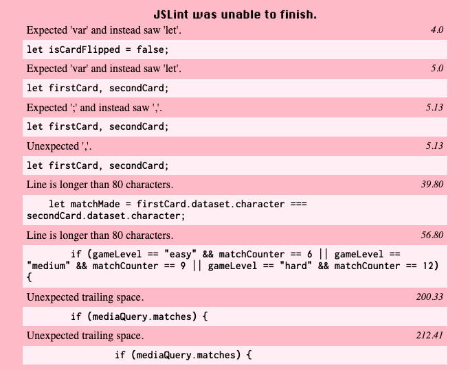
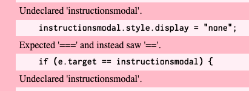
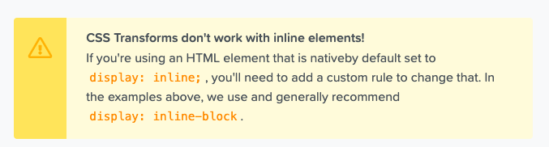
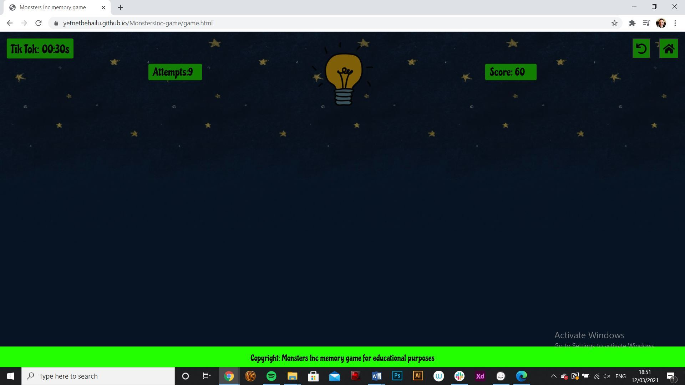
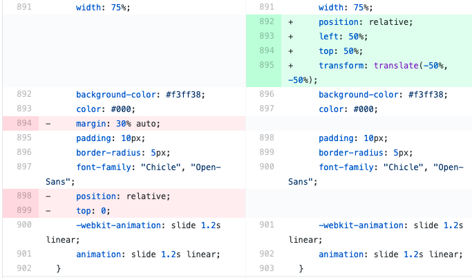
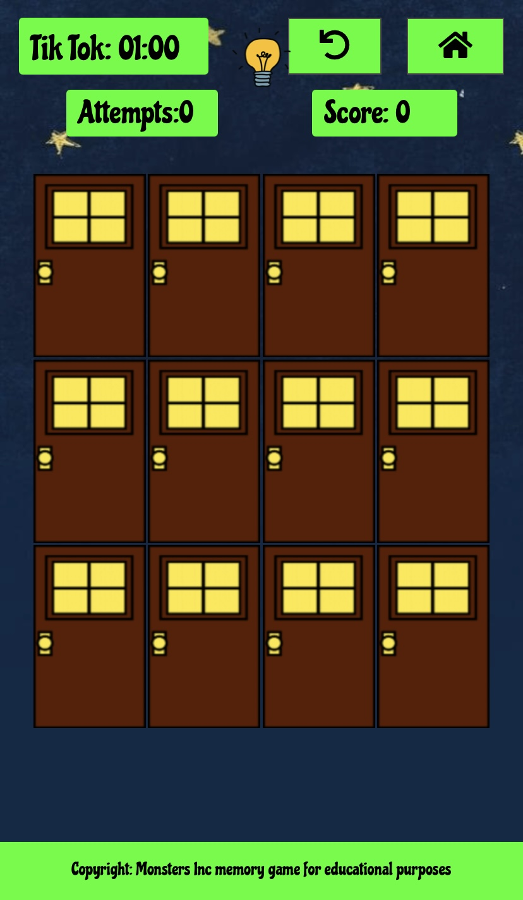
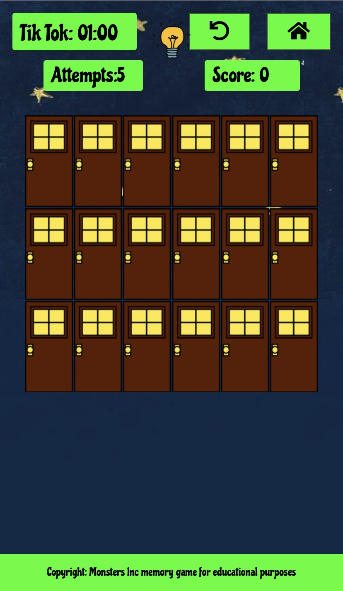
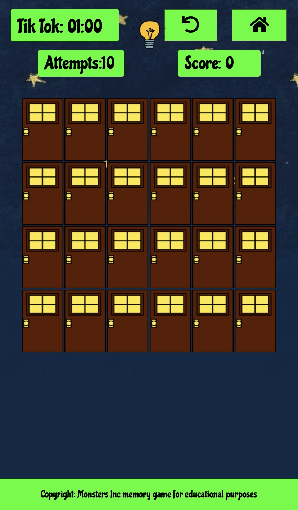

[Chrome DevTools](https://developers.google.com/web/tools/chrome-devtools) - Used tool consistently to identify issues arising and to test changes made throughout site development to ensure web application desired appearance and functionality.

[W3C Markup Validator](https://validator.w3.org/)- Used to validate HTML; No errors found

[W3 CSS Validation Service](https://jigsaw.w3.org/css-validator/#validate_by_input) - Used to validate CSS; No errors found

[JSL int](https://jslint.com/)- Used to validate Javascript code no major errors depicted below (game.js) 

 (scripts.js) 

- Modifications let/var, js code beautified trailing space removed, operator modified to equal type/value.

### Issues and Resolutions

**Errors encountered and resolved during development process**

- In the initial phase of creating the cards, I had made use of the Bootstrap col & row system. I had also tried to implement the Bootstrap grid format. However as I was trying to fit the images inside the cols/grid dimensions, I was unable to make it happen without the images being stretched or to small when altering the screen size. This problem maintained even after re-sizing and having the images adjusted to be equal dimensions. I also tested different width and height dimensions for my card objects and game-card row, still wouldn't work. Until I removed the grid and col classes then I was able to adjust my images according to my card dimensions. Now this seemed like the right solution for me at the time, but moving forward had caused me some unwanted trouble. First obstacle displayed when trying to align the cards according to desired layout. Because I had not used cols or grid formatting the cards where sliding and adjusting freely when re-sizing screen view, to prevent this I used flex box to align my cards according to desired appearance. Once again worked fine for the time being. Not until having to adjust the card amount & layout according to game level chosen did this become a challenge. Since my cards(flex-items) were only contained by the flex wrapper, I would now have to work around adjusting the cards width and height within the wrapper as well as the wrapper dimension. Which in the end meant an over use/ dependency on media queries. I have definitely learnt from my mistakes and moving forward will make sure to learn & understand how to incorporate images inside grid / col formats.

- Accessing the different game levels from start page. This was a tricky one, until I discovered the use of session storage and the effectiveness of using switch statements. Because I have two separate js files each connected to a separate html file I could not access code between the two files. To do such I figured out that a possible way would be to save the variable using session storage.setItem and retrieve it using session storage.getItem in the alternate file. Then by implementing a switch statement alter between the key values stored in session storage. Combining these two methods I was able to make the game level buttons re-direct to game page with the right level layout. 

- Another challenge was specifying certain conditions to only be executed depending on game level. Because the switch statement I had curated was only meant to be called once when the game page is loaded, functions that I desired to be executed multiple times would have to be written outside the switch statement. Because these conditions were written outside the switch statement I would have to reference the key values each time to specify the targeted level.

- I encountered an issue when trying to have my FontAwsome smiley/sad face icons rotating. I wanted the icons to rotate around its own center, so i had written a rotate animation with linear motion to spin infinitely using key frame transform 0deg to 359deg in circle motion. This alone would not work, on research i found this notation on [FontAwsome](https://fontawesome.com/how-to-use/on-the-web/styling/rotating-icons) : 
In my situation neither display block nor inline block would fix the problem, what made it work was rather the inline table value. Which appears to be a block-level context according to [MDN definition inline-table](https://developer.mozilla.org/en-US/docs/Web/CSS/display). 

**Errors encountered and resolved Post-Deployment**

- After deployment testing my web application on AmIresponsive I noticed that my cards were stretching outside screen view on smaller devices, this was due to a mistake on my part setting a fixed width media query on game page larger than screen viewport dimension on smaller devices. Simply resolved by removing the media query with the fixed and setting a more responsive vw & vh unit on the game page class instead. 

- Testing on my actual iPhone 11 devices i noticed a glitch when flipping over a card the image appears a bit delayed. Unsolved mystery.

* [Lighthouse](https://chrome.google.com/webstore/detail/lighthouse/blipmdconlkpinefehnmjammfjpmpbjk?hl=en) - Used to test the performance of the application on desktop & mobile. Following reports were generated:

 * Index.html- Desktop - [LINK](https://github.com/yetnetbehailu/MonstersInc-game/tree/master/assets/testing-desktop)
 * Performance Report- 98%

 * Accessibility Report- 100% Updated accessible name added to button so that screen readers and other assistive technologies provides user with clear description of what the button does.

 * Best Practices- 79% Lost points due to libraries with known security vulnerabilities detected, that could be exploited by attackers. Display of images with incorrect aspect ratio and images with low resolution.

 * SEO Report - 100% 

 * game.html- Desktop - [LINK](https://github.com/yetnetbehailu/MonstersInc-game/tree/master/assets/testing-desktop)

 * Performance Report- 88% Lost points due to render-blocking resources, unused JavaScript error, duplicate modules in JavaScript bundle

 * Accessibility Report- 100% 

 * Best Practices- 93% Lost points due to libraries with known security vulnerabilities detected, that could be exploited by attackers.(?)

 * SEO Report - 100% 

 Index.html- Mobile - [LINK](https://github.com/yetnetbehailu/MonstersInc-game/tree/master/assets/testing-mobile)
 * Performance Report- 75% Lost points due to render-blocking resources & unused CSS(?)

 * Accessibility Report- 100% 

 * Best Practices- 79% Lost points due to libraries with known security vulnerabilities detected, that could be exploited by attackers. Display of images with incorrect aspect ratio and images with low resolution.(Remark: Receive info in regards to img Displayed size ,Actual size, Expected size on lighthouse, however when adapting img to either displayed or expected size it seem to resolve the warning but it shows the img in a worse resolution very blurry)Therefor decided to not make a change(?)

 * SEO Report - 100% 

 * game.html- Mobile - [LINK](https://github.com/yetnetbehailu/MonstersInc-game/tree/master/assets/testing-mobile)

 * Performance Report- 80% Issues serve images in next-gen formats Eliminate render-blocking resources, properly size images, remove unused CSS(?)

 * Accessibility Report- 100% 

 * Best Practices- 93% Lost points due to libraries with known security vulnerabilities detected, that could be exploited by attackers.(Remark: Receive info in regards to img Displayed size ,Actual size, Expected size on lighthouse, however when adapting img to either displayed or expected size it seem to resolve the warning but it shows the img in a worse resolution very blurry)Therefor decided to not make a change(?)

 * SEO Report - 100% 

- After deploying the project a couple of issues is reported: 

 - 1) Where the hero-img was appearing blurry and too small in relation to the start page buttons. Resolved issue by altering img width/unit to vw/vh instead of % that was stretching the img.

 -2) The game over/win modals appearing and then disappearing leaving user unable to click or move anywhere else on the page. Resolved by amending the css of the modals, (red marked code faulty, green corrected).  
 
 ### Manual testing ###
 
 Following elements were tested to ensure web application functioning accurately.
    - Start page-(Index.html)

 - Music play/pause button hover effect display on cursor hover. Music play/pause and change icon on click.

 - "How to play" button & "Start game" button hover effect display on cursor hover. Tested on click to ensure modals/overlays display. 

 - instructions modal close button hover effect tested on hover & on click to ensure modal/overlay closes.

 - Game level modal close button hover effect tested on hover & on click to ensure modal/overlay closes. Game level button links tested for hover effects to ensure that the colour changes from dark green to bright green and that each link opens the correct page.
    
 - Click on window outside modal closes modals/overlays.

 - Cursor changes from default to pointer when element is clickable.

 - Game page-(game.html)
 
 - Re-start button hover effect display on cursor hover & re-loads page to restart game when pressed.

 - Home Button hover effect display on cursor hover & returns user to home page when clicked.

 - Timer starting on first card click counting down in seconds & triggering game over modal/overlay when timer reaches zero seconds. Depending on the game level a time bonus is added when a matching pair is found.

 - Attempts board depending on game level two different functionality. Easy the board counts the card pairs that has been flipped each time the second card pair is clicked. Medium & hard level there will be a draw limit keeping track of user card pair flips counting each time a second card pair is flipped. Each time a matching card pair is found 1 bonus draw is added however if draws have all gone to use and board reaches zero the game is lost & game over modal/overlay appears.

 - Scoreboard when two cards that are clicked show identical characters then 10 points are added to score result however if cards are not identical then 2 points are deducted from score result (note no deduction below 0).

 - Disclaimer: Each game level was played to verify that the correct points and penalties were being given and that time was being accurately displayed. Mistakes were made on purpose to ensure that the score and attempts counters were displaying correctly.

 - Game Board displays accurately on load
 - 12 card easy board display 
 - 18 card medium board display 
 - 24 card hard board display 

 - Cards animation triggered on card click which flips card over. While check for match function is running cards cannot be clicked as game board is disable - tried clicking on other cards while active cards are face up. Matched pairs disappear from game board as their visibility is hidden on match, enabling user to click on them again. Flipped cards that are not a match are returned to starting position. As soon as cards start to flip back into position other cards can be flipped. Pairs found within allotted time and depending on game level according to draw limit triggers Win modal/overlay. Timer stops when game is won. Cards stay face up long enough for user to see images. Clicks outside of game board does not affect attempts board count or scoreboard count. Repeated clicks on same card faced up does not affect attempts board count or scoreboard count.

 - Win modal/overlay animation triggered when winning conditions are met. If user wants to restart game then yes button needs to be clicked(refreshes page). If user does not wish to continue playing or wants to switch difficulty level then no button needs to be clicked. Both buttons display hover effect on hover. Modal smiley animation visible as soon as modal is made visible.

 - Game over modal/overlay triggered when losing conditions are met. If user wants to restart game then yes button needs to be clicked(refreshes page). If user does not wish to continue playing or wants to switch difficulty level then no button needs to be clicked. Both buttons display hover effect on hover. Modal sad face animation visible as soon as modal is made visible.

 ### Web application tested on following devices.
 
 - iPad

 - Moto G4

 - iPhone 5/SE,6,7,8,11,X,PLUS 

 - 13" Mac book air

 - Galaxy s9

 - Medium screen 1024×800

 - Large screen 1280x 800

### User Stories Validation

 - _"As a **user**, I want a game that is fun to play."_
 - Bright & vibrant colour palette including interesting images and animations. Challenging with various difficulty levels to choose from. Sound available start page. 
 
 - _"As a **user**, I want the game to challenge my memory."_
 - The game challenges the memory by requiring the player to remember where cards with identical characters are positioned.
 
 - _"As a **user**, I want to easily access instructions on how to play."_
 - The How to Play button is clearly made visible with indicating description and hover effect on cursor hover. When pressed triggering the instructions modal to appear containing clear explanation on how to play the game.
 
 - _"As a **user**, I'd like a time limit to add more of a challenge."_
 - Time limit added with additional feature.
 
 - _"As a **user**, I'd like a card drawing limit to add more of a challenge."_
 - Card draw limit added with additional feature (note dependent on difficulty level). 
 
 - _"As a **user**, I want the option to change the level of difficulty to add complexity when desired."_
 - The user is provided with three difficulty levels to choose from easy, medium & hard.
 
 - _"As a **user**, I want to be able to read my score result_".
       - Scoreboard visible at game page throughout play.